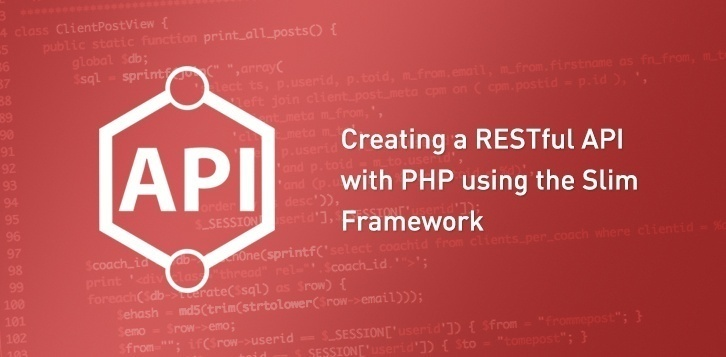

<h1 align="center">
  
</h1>

<h4 align="center">
 A REST API using Slim. The API will provide a way for users to manage a todo list. Users can interact with the database by retrieving a list of tasks, as well as adding, updating and deleting tasks in the database.
</h4>

<p align="center">
  <a href="https://opensource.org/licenses/MIT">
    
  </a>
  
  <a href="https://GitHub.com/callmedw/php-todo-rest-api/issues/">
    
  </a>
</p>

<p align="center">
  <!-- <a href="#preview">Screenshot</a> • -->
  <a href="#features">Features</a> •
  <a href="#required-technologies">Requirements</a> •
  <a href="#how-to-use">How To Use</a> •
  <a href="#browser-support">Browser Support</a> •
  <a href="#known-bugs">Bug Report</a> •
  <a href="#contact">Contact</a> •
  <a href="#license">License</a>
</p>
<br>

<!-- ## Preview -->
## Features

To pass this code review with a Meets Expectations the following criteria are required:
* This API is versioned, all routes should be prefixed with **/api/v1**

- [ ] Build Task model
  * Model stores id, name, and status.

- [ ] Build Todo DAO Implementation that uses Sql2o
  * Task model implements all methods to interface with the Todo database.

- [ ] Fetch Todos
  * **GET /api/v1/todos** returns all todos and populates the web application.

- [ ] Create a New Todo
  * **POST /api/v1/todos** creates a new Todo, returns it and sets the appropriate status code.

- [ ] Update an existing Todo
  * **PUT /api/v1/todos/{id}** is handled and proper Todo is updated.

- [ ] Delete an existing Todo
  * **DELETE /api/v1/todos/{id}** deletes the appropriate Todo sends back the appropriate status code and an empty body.

## Required Technologies

* [PHP](https://php.net)
* [Slim](https://www.slimframework.com/)

## Suggested Technologies

* [Git](https://git-scm.com)
* [Atom](https://atom.io/)
* [Composer](https://getcomposer.org/)

## How To Use

To clone and run this application, you will probably want [Git](https://git-scm.com) installed on your computer. To edit this project you may want a text-editor like [Atom](https://atom.io/). To install [Slim](https://www.slimframework.com/) you will most likely want a dependency manager like [Composer](https://getcomposer.org/).

```bash
# Clone this repository
$ git clone https://github.com/callmedw/https://github.com/callmedw/php-todo-rest-api.git

# Open in atom
$ atom https://github.com/callmedw/php-todo-rest-api

# Go to project directory root
$ $ cd https://github.com/callmedw/php-todo-rest-api

# Use composer to install packages
$ composer install

```

## Known Bugs

🐞

## Contact

_Contact: hello@mynameisdanaweiss.com_

## Contributors

<!-- prettier-ignore -->
| [<br /><sub><b>Dana Weiss</b></sub>](https://github.com/callmedw)<br /> |
| :---: |

## License

MIT License

Copyright (c) 2019 Dana Weiss
